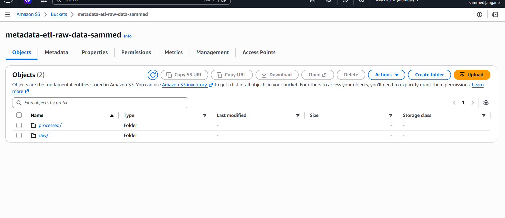
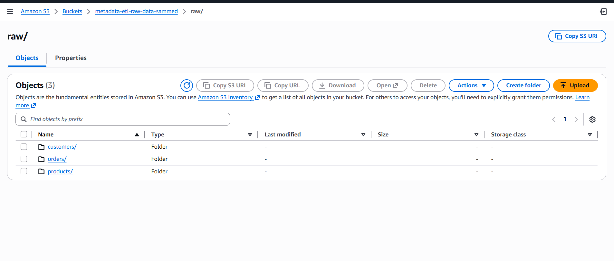
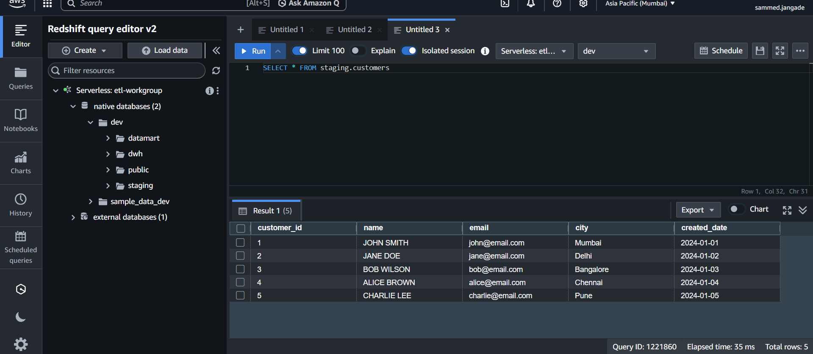
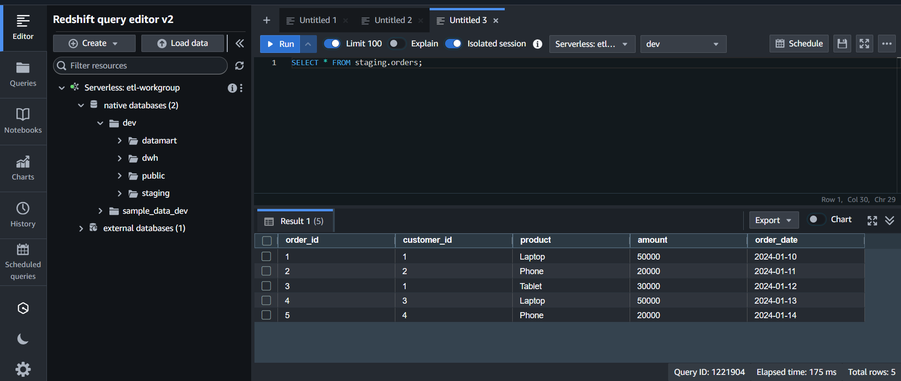
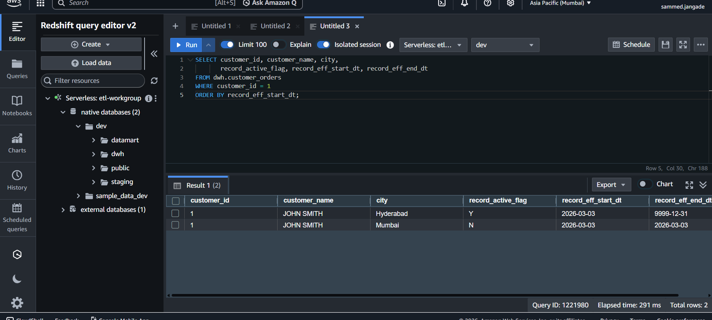
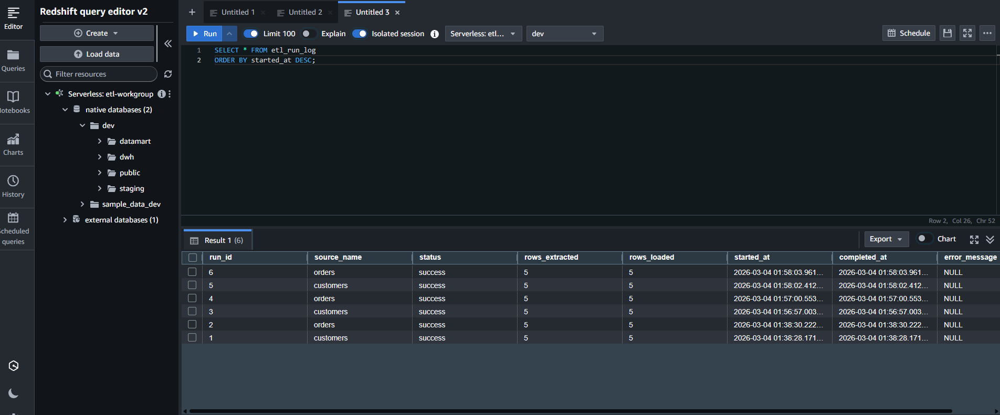

# Metadata-Driven ETL Framework

A production-grade, config-driven ETL pipeline built on AWS that enables seamless onboarding of new data sources without code changes. New sources are registered via a single database entry, and the pipeline automatically handles extraction, transformation, and loading across a 3-layer data warehouse architecture — orchestrated end-to-end via Apache Airflow.

---

## Key Features

- **Metadata-driven design** — onboard new data sources by inserting one row into a config table. Zero code changes required.
- **3-layer architecture** — data flows through Staging → DWH → Datamart
- **SCD Type 2** — full historical tracking of record changes with enterprise audit columns
- **Airflow orchestration** — DAG with task-level retries, dependency management, and failure alerting
- **Audit logging** — every pipeline run is logged with row counts, status, timestamps, and batch IDs
- **AWS-native** — built on S3 and Redshift Serverless

---

## Architecture

```
┌─────────────────────────────────────────────────────┐
│                   SOURCE FILES                       │
│              (CSV, JSON — stored in S3)              │
└─────────────────────┬───────────────────────────────┘
                      │
                      ▼
┌─────────────────────────────────────────────────────┐
│                  Amazon S3                           │
│         s3://bucket/raw/customers/                   │
│         s3://bucket/raw/orders/                      │
└─────────────────────┬───────────────────────────────┘
                      │  boto3
                      ▼
┌─────────────────────────────────────────────────────┐
│              Python ETL Engine                       │
│                                                      │
│  1. Reads etl_source_config from Redshift            │
│  2. Extracts files from S3 via boto3                 │
│  3. Transforms data (clean, validate, standardize)   │
│  4. Loads into Redshift staging via psycopg2         │
└──────┬──────────────────────────────────────────────┘
       │
       ▼
┌─────────────┐     ┌─────────────┐     ┌─────────────┐
│   STAGING   │────▶│     DWH     │────▶│  DATAMART   │
│             │     │             │     │             │
│ Raw load    │     │ SCD Type 2  │     │ Views/MVWs  │
│ Full/Incr   │     │ Stored Procs│     │ BI-ready    │
└─────────────┘     └─────────────┘     └─────────────┘
                          │
                          ▼
                  ┌──────────────┐
                  │ etl_run_log  │
                  │ Audit table  │
                  └──────────────┘
                          │
                          ▼
┌─────────────────────────────────────────────────────┐
│                 Apache Airflow                       │
│                                                      │
│  extract_load_staging >> load_dwh >> validate_datamart│
│                                                      │
│  - Daily schedule                                    │
│  - Task-level retries (2x, 5min delay)              │
│  - Email alerts on failure                          │
└─────────────────────────────────────────────────────┘
```

---

## Airflow DAG

The pipeline is orchestrated via a 3-task Airflow DAG:

```
extract_load_staging >> load_dwh >> validate_datamart
```

| Task | Description |
|---|---|
| `extract_load_staging` | Reads active sources from config table, extracts from S3, transforms, loads to Redshift staging |
| `load_dwh` | Calls SCD Type 2 stored procedure to move data from staging to DWH |
| `validate_datamart` | Runs row count check on datamart view to confirm data availability |

DAG is configured with:
- **Schedule:** `@daily`
- **Retries:** 2 attempts with 5 minute delay
- **Email alerts** on task failure
- **No backfill** (`catchup=False`)

---

## Tech Stack

| Component | Technology |
|---|---|
| Cloud Storage | AWS S3 |
| Data Warehouse | Amazon Redshift Serverless |
| ETL Language | Python 3.x |
| AWS SDK | boto3 |
| DB Connector | psycopg2 |
| Orchestration | Apache Airflow |
| Data Processing | pandas |

---

## Project Structure

```
metadata-etl-framework/
│
├── dags/
│   └── etl_dag.py              # Airflow DAG — 3 task pipeline
│
├── pipelines/
│   ├── __init__.py
│   ├── extractor.py            # Reads files from S3 using boto3
│   ├── transformer.py          # Cleans and validates data
│   ├── loader.py               # Loads to Redshift (full load)
│   └── orchestrator.py         # Reads config, runs pipeline, logs results
│
├── sql/
│   ├── staging/
│   │   └── create_tables.sql               # Staging table definitions
│   ├── dwh/
│   │   └── sp_load_customer_orders.sql     # SCD Type 2 stored procedure
│   └── datamart/
│       └── vw_customer_summary.sql         # Business-facing view
│
├── data/mock/
│   ├── customers.csv           # Mock customer data
│   └── orders.json             # Mock order data
│
├── screenshots/                # Pipeline execution screenshots
├── scheduler.py                # Lightweight scheduler (non-Airflow alternative)
├── main.py                     # Entry point
├── config_template.py          # Config structure (fill with your credentials)
├── .gitignore
└── README.md
```

---

## How the Metadata-Driven Design Works

The `etl_source_config` table in Redshift drives the entire pipeline:

```sql
source_name | source_type | s3_key                        | target_schema | target_table | load_type | active
customers   | csv         | raw/customers/customers.csv   | staging       | customers    | full      | Y
orders      | json        | raw/orders/orders.json        | staging       | orders       | full      | Y
```

To onboard a new source, simply insert a new row — no Python code changes needed.

---

## SCD Type 2 Implementation

The DWH layer tracks full history of record changes using enterprise audit columns:

| Column | Purpose |
|---|---|
| `surrogate_key` | Unique identifier per record version |
| `record_eff_start_dt` | When this version became active |
| `record_eff_end_dt` | When this version expired (9999-12-31 if current) |
| `record_active_flag` | Y = current record, N = historical |
| `btch_insert_id` | Batch that inserted this record |
| `btch_upd_id` | Batch that expired this record |
| `lst_insrt_dt` | Timestamp of insertion |
| `lst_upd_dt` | Timestamp of last update |

---

## Setup Instructions

### Prerequisites
- Python 3.x
- AWS account with S3 and Redshift Serverless
- AWS CLI configured (`aws configure`)
- Apache Airflow 2.x

### Installation

```bash
git clone https://github.com/sammedjangade/metadata-etl-framework.git
cd metadata-etl-framework
pip install boto3 psycopg2-binary pandas apache-airflow
```

### Configuration

Copy the template and fill in your credentials:
```bash
cp config_template.py config.py
```

Edit `config.py`:
```python
AWS_REGION = 'your-region'
BUCKET_NAME = 'your-s3-bucket'
REDSHIFT_HOST = 'your-redshift-endpoint'
REDSHIFT_PORT = 5439
REDSHIFT_DB = 'your-database'
REDSHIFT_USER = 'your-username'
REDSHIFT_PASSWORD = 'your-password'
```

### AWS Setup

1. Create an S3 bucket with folders: `raw/customers/`, `raw/orders/`
2. Set up Redshift Serverless and run SQL scripts in `sql/` folder in this order:
   - `sql/staging/create_tables.sql`
   - `sql/dwh/sp_load_customer_orders.sql`
   - `sql/datamart/vw_customer_summary.sql`
3. Upload mock data to S3:
```bash
aws s3 cp data/mock/customers.csv s3://your-bucket/raw/customers/
aws s3 cp data/mock/orders.json s3://your-bucket/raw/orders/
```

### Run via Airflow

```bash
# Set DAGs folder
export AIRFLOW__CORE__DAGS_FOLDER=./dags

# Initialize Airflow
airflow db init
airflow users create --username admin --password admin --role Admin --email admin@example.com --firstname Admin --lastname User

# Start Airflow
airflow webserver --port 8080 &
airflow scheduler &
```

Then trigger the DAG from the Airflow UI at `http://localhost:8080`

### Run Without Airflow

```bash
# Single run
python main.py

# Daily scheduler
python scheduler.py
```

---

## Screenshots

### S3 Bucket Structure


### Pipeline Execution


### Staging Data Loaded


### SCD Type 2 — History Tracking


### ETL Run Log


### Datamart View


---

## Future Improvements

- **Incremental load support** — watermark-based loading for high-volume sources
- **Data quality framework** — rule-based validation layer before staging load
- **Additional sources** — onboard products and other datasets via config
- **dbt integration** — replace stored procedures with dbt models for version control and testing
- **MWAA deployment** — migrate from local Airflow to AWS Managed Workflows for Apache Airflow

---

## Author

Sammed Jangade — [LinkedIn](https://linkedin.com/in/yourprofile) | [GitHub](https://github.com/sammedjangade)
